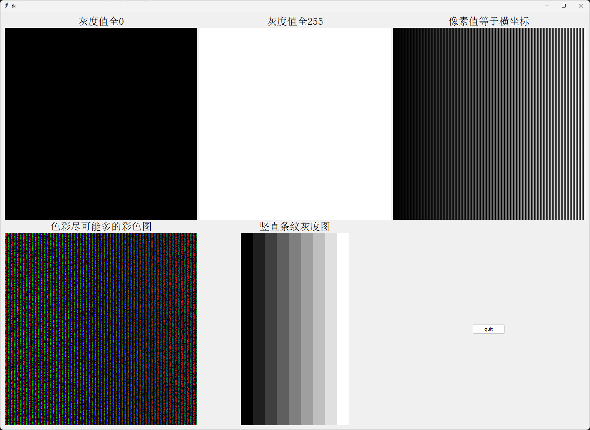

# 数字图像处理实验一：图像显示

姓名：钟军凯

学号：22211374

## 实验目的

1.  掌握二维（灰度）和三维（彩色）数字图像的表示方法
2. 掌握图像显示的编程实现方法
3.  熟悉Python图形用户界面设计工具，Tkinter的基本使用方法
4. 建立数字图像数学表示与视觉感知之间的联系

## 实验内容

1.  使用Python自带的Tkinter库建立一个图形用户界面（graphic user interface，GUI）
2. 根据图像表示的基本方法生成表示数字图像的二维数组与三维数组，通过GUI显示生成的灰度图像与彩色图像
3.  生成以下表示数字图像的二维数组，并在界面中显示：
   - 全部像素为0的512 x 512大小的灰度图像
   - 全部像素为255的512 x 512大小的灰度图像
   - 像素值等于横坐标的512 x 512大小的灰度图像
   - 能够表示尽可能多色彩的彩色图像
   - 灰度分别为0、31、63、95、127、159、191、224、255，且宽度为32像素的竖直条纹灰度图像
4. 观察内容3中产生的图像，解释观察到的图像与自己的预期图像的差异

## 实验源码

``` python
import tkinter as tk
from tkinter import ttk
from PIL import Image
from PIL import ImageTk
import numpy as np

''' 创建表示图像的数组 '''
column = 512
row = 512

array_1 = np.zeros((column, row), dtype = np.uint8)           # 像素值全为0的灰度图像的数组，大小为512*512
array_2 = np.full((column, row), 255, dtype = np.uint8)       # 像素值全为255的灰度图像的数组，大小为512*512
array_3 = np.zeros((column, row), dtype = np.uint16)          # 像素值等于横坐标的灰度图像的数组，大小为512*512
array_4 = np.random.randint(0, 256, size = (column, row, 3))  # 表示尽可能多色彩的彩色图像的数组，大小为512*512*3
array_5 = np.zeros((column, 32 * 9), dtype = np.uint8)        # 竖直条纹灰度图像的数组

# 创建array_3
for i in range(column):
    array_3[:, i] = i

# 创建array_5
for i in range(9):
    array_5[:, 32 * i : 32 * (i + 1)] = (32 * i) if i == 0 or i == 7 else (32 * i - 1)

''' 数组转化为图像 '''
image_1 = Image.fromarray(array_1, mode = "L")    # 像素值全为0的灰度图像
image_2 = Image.fromarray(array_2, mode = "L")    # 像素值全为255的灰度图像
image_3 = Image.fromarray(array_3, mode = "L")    # 像素值等于横坐标的灰度图像
image_4 = Image.fromarray(array_4, mode = "RGB")  # 尽可能多色彩的彩色图像
image_5 = Image.fromarray(array_5, mode = "L")    # 竖直条纹灰度图像的数组

''' 创建GUI界面用于显示图片 '''
# 创建GUI图窗
root = tk.Tk()
frame = ttk.Frame(root, padding = 10)
frame.grid()

# 将图像转化为tkinter可用的PhotoImage对象
image_tk_1 = ImageTk.PhotoImage(image_1)
image_tk_2 = ImageTk.PhotoImage(image_2)
image_tk_3 = ImageTk.PhotoImage(image_3)
image_tk_4 = ImageTk.PhotoImage(image_4)
image_tk_5 = ImageTk.PhotoImage(image_5)

# 显示图片
image_label_1 = ttk.Label(frame, image = image_tk_1)
image_label_1.grid(column =0 , row = 1)
image_label_2 = ttk.Label(frame, image = image_tk_2)
image_label_2.grid(column = 1, row = 1)
image_label_3 = ttk.Label(frame, image = image_tk_3)
image_label_3.grid(column = 2, row = 1)
image_label_4 = ttk.Label(frame, image = image_tk_4)
image_label_4.grid(column = 0, row = 3)
image_label_5 = ttk.Label(frame, image = image_tk_5)
image_label_5.grid(column = 1, row = 3)

# 为图片添加标注
style = ttk.Style()
style.configure("TLabel", font = ("宋体", 20))  # 设置字体和字体大小
image_text_1 = ttk.Label(frame, text = "灰度值全0", style = "TLabel")
image_text_1.grid(column = 0, row = 0)
image_text_2 = ttk.Label(frame, text = "灰度值全255", style = "TLabel")
image_text_2.grid(column = 1, row = 0)
image_text_3 = ttk.Label(frame, text = "像素值等于横坐标", style = "TLabel")
image_text_3.grid(column = 2, row = 0)
image_text_4 = ttk.Label(frame, text = "色彩尽可能多的彩色图", style = "TLabel")
image_text_4.grid(column = 0, row = 2)
image_text_5 = ttk.Label(frame, text = "竖直条纹灰度图", style = "TLabel")
image_text_5.grid(column = 1, row = 2)

# 添加“退出”按键
button = ttk.Button(frame, text = "quit", command = root.destroy)
button.grid(column = 2, row = 3)

root.mainloop()
```

## 实验结果

实验结果如图1所示。



<div style="text-align: left;">
    <b>图1</b>：第一行第一张图为像素值全为0的灰度图；第一行第二张图为像素值全为255的灰度图；第一行第三张图为像素值等于横坐标的灰度图；第二行第一张图为色彩尽可能多的彩色图；第二行第二张图为竖直条纹灰度图
</div>

## 实验结果分析

当灰度值为0和255时，对应的颜色就是黑色和白色；当灰度值与图像横坐标相同时，整幅图像将会展现出渐变的效果，但是实际的效果会有条纹；对于彩色图，因为要求色彩尽可能多，所以在实验中采用了随机数的方式来产生每一个像素的RGB值；对于竖直条纹灰度图，有明显的条纹效果，同时也具有渐变的效果。

## 遇到的问题及解决方案

### 问题一

**问题描述**

在尝试运行代码的时候，遇到了如图2所示的问题。


<div style="text-align: center;">
    <b>图2</b>：问题一
</div>

**解决方案**

根据错误提示“Too early to create image: no default root window”，猜测是因为在`root = tk.Tk()`之前就使用了`ImageTk.PhotoImage()`，所以把`ImageTk.PhotoImage()`放到`root = tk.Tk()`之后，再次运行代码，问题解决。

### 问题二

**问题描述**

在刚开始的时候，采用了`array = []`的方式创建数组，在运行代码的时候，出现报错：“ AttributeError: 'list' object has no attribute '\_\_array_interface\_\_' ”。

**解决方案**

`array = []`这种形式不是数组，而是列表，python中没有内置的`array`的类型，所以考虑使用`numpy`来创建数组。

### 问题三

**问题描述**

对于像素值等于横坐标值的灰度图，理论上应该有渐变的效果，但是呈现出来的效果是具有条纹。

**解决方案**

灰度值的取值范围是0到255，因为图像的大小是512*512，图像的像素值又要等于其横坐标，所以会有超出灰度值范围的情况，导致会有渐变效果不平滑的情况出现。可以考虑通过归一化，将像素值映射到0到255之间。最终得到的效果如图3所示。


<div style="text-align: center;">
    <b>图3</b>：第三列为无归一化和有归一化效果对比
</div>

添加归一化之后的全部代码为：

```python
import tkinter as tk
from tkinter import ttk
from PIL import Image
from PIL import ImageTk
import numpy as np

''' 创建表示图像的数组 '''
column = 512
row = 512

array_1 = np.zeros((column, row), dtype = np.uint8)           # 像素值全为0的灰度图像的数组，大小为512*512
array_2 = np.full((column, row), 255, dtype = np.uint8)       # 像素值全为255的灰度图像的数组，大小为512*512
array_3 = np.zeros((column, row), dtype = np.uint16)          # 像素值等于横坐标的灰度图像的数组，大小为512*512
array_4 = np.random.randint(0, 256, size = (column, row, 3))  # 表示尽可能多色彩的彩色图像的数组，大小为512*512*3
array_5 = np.zeros((column, 32 * 9), dtype = np.uint8)        # 竖直条纹灰度图像的数组
array_3_fixed = np.zeros((column, row), dtype = np.uint8)     # 像素值等于横坐标的灰度图像的数组，大小为512*512

# 创建array_3
for i in range(column):
    array_3[:, i] = i

# 创建array_3_fixed
for i in range(column):
    array_3_fixed[:, i] = 255 * i / 512

# 创建array_5
for i in range(9):
    array_5[:, 32 * i : 32 * (i + 1)] = (32 * i) if i == 0 or i == 7 else (32 * i - 1)

''' 数组转化为图像 '''
image_1 = Image.fromarray(array_1, mode = "L")    # 像素值全为0的灰度图像
image_2 = Image.fromarray(array_2, mode = "L")    # 像素值全为255的灰度图像
image_3 = Image.fromarray(array_3, mode = "L")    # 像素值等于横坐标的灰度图像
image_4 = Image.fromarray(array_4, mode = "RGB")  # 尽可能多色彩的彩色图像
image_5 = Image.fromarray(array_5, mode = "L")    # 竖直条纹灰度图像的数组
image_3_fixed = Image.fromarray(array_3_fixed, mode = "L")

''' 创建GUI界面用于显示图片 '''
# 创建GUI图窗
root = tk.Tk()
frame = ttk.Frame(root, padding = 10)
frame.grid()

# 将图像转化为tkinter可用的PhotoImage对象
image_tk_1 = ImageTk.PhotoImage(image_1)
image_tk_2 = ImageTk.PhotoImage(image_2)
image_tk_3 = ImageTk.PhotoImage(image_3)
image_tk_4 = ImageTk.PhotoImage(image_4)
image_tk_5 = ImageTk.PhotoImage(image_5)
image_tk_3_fixed = ImageTk.PhotoImage(image_3_fixed)

# 显示图片
image_label_1 = ttk.Label(frame, image = image_tk_1)
image_label_1.grid(column =0 , row = 1)
image_label_2 = ttk.Label(frame, image = image_tk_2)
image_label_2.grid(column = 1, row = 1)
image_label_3 = ttk.Label(frame, image = image_tk_3)
image_label_3.grid(column = 2, row = 1)
image_label_4 = ttk.Label(frame, image = image_tk_4)
image_label_4.grid(column = 0, row = 3)
image_label_5 = ttk.Label(frame, image = image_tk_5)
image_label_5.grid(column = 1, row = 3)
image_label_3_fixed = ttk.Label(frame, image = image_tk_3_fixed)
image_label_3_fixed.grid(column = 2, row = 3)

# 为图片添加标注
style = ttk.Style()
style.configure("TLabel", font = ("宋体", 20))  # 设置字体和字体大小
image_text_1 = ttk.Label(frame, text = "灰度值全0", style = "TLabel")
image_text_1.grid(column = 0, row = 0)
image_text_2 = ttk.Label(frame, text = "灰度值全255", style = "TLabel")
image_text_2.grid(column = 1, row = 0)
image_text_3 = ttk.Label(frame, text = "像素值等于横坐标", style = "TLabel")
image_text_3.grid(column = 2, row = 0)
image_text_4 = ttk.Label(frame, text = "色彩尽可能多的彩色图", style = "TLabel")
image_text_4.grid(column = 0, row = 2)
image_text_5 = ttk.Label(frame, text = "竖直条纹灰度图", style = "TLabel")
image_text_5.grid(column = 1, row = 2)
image_text_3_fixed = ttk.Label(frame, text = "像素值等于横坐标 归一化平滑", style = "TLabel")
image_text_3_fixed.grid(column = 2, row = 2)

# 添加“退出”按键
button = ttk.Button(frame, text = "quit", command = root.destroy)
button.grid(column = 1, row = 4)

root.mainloop()
```

